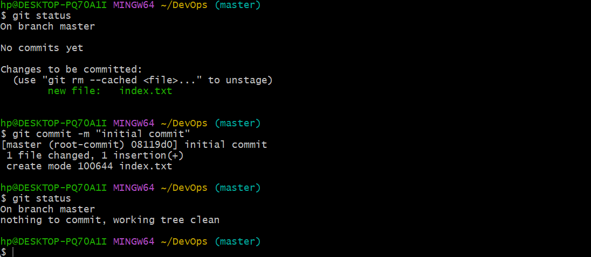
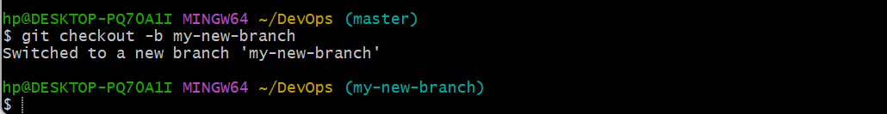
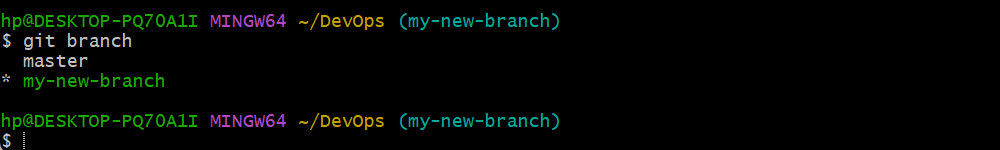
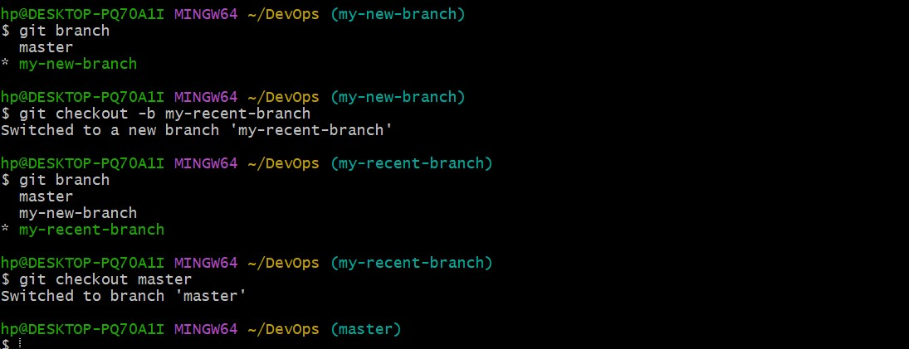
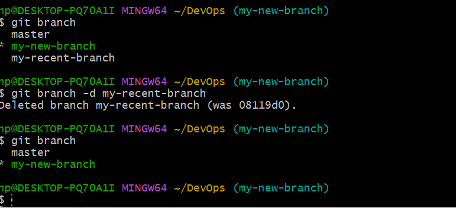
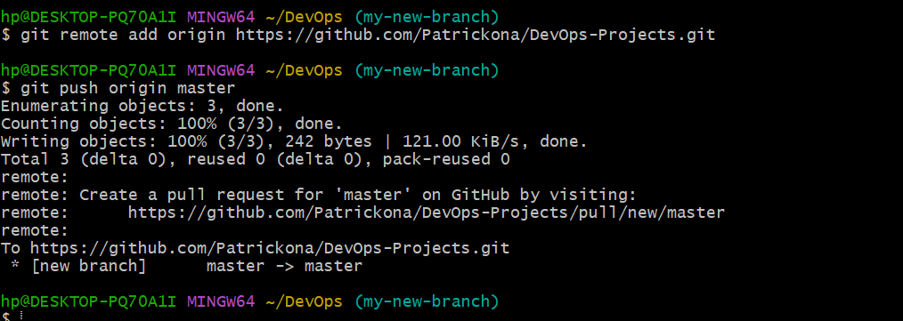

### GIT ###
## Basic File Maniputalion using Git Bash ##
# Git Add . #
The **git add .** enables us add a file in a working directory to the staging area. 

# Git Commit #
The **git commit** command gives us information of our repository at a given time. The use of the **git commit -m** flag provides us with a commit message. This provides context about the commit.A descriptive message is also added for reference

# Git Checkout -b #
The **git checkout -b** command enables us create a branch. This can be used to copy our main source code which will enable  us make changes without affecting our source code. This can be helpful when trying to develop a feature as improvements can be made here and tested before being added to our main source code.

# Git Branch #
The **git branch** command list the branches in our local repository

# Git Checkout #
The **git checkout** command enables us move between various branches

# Git Branch -d #
The **git branch -d** command enables us delete a branch

# Git remote add #
The **git remote add** helps us merge our remote repository with our local repository

# Git Push #
The **git push** uploads local repository to remote repository

# Git Clone #
The **git clone** helps us copy our remote repository to our local machine. This is helpful when we want to make improvements to a source code. This is helpful for teams to work on a project collaboratively even when they are not in same location.
![Below screenshot serves as a reference]
