## WEB STACK IMPLEMENTATION ##
### Setting up LEMP STACK using EC2 instance ###
To do this, we need the following 
- An account on AWS.
- We create our virtual machine (EC2 instance). We will be using **Ubuntu server 20.04 LTS** from Amazon Machine Image (free tier)

Steps to create a virtual machine (EC2 instance), Click here [(https://github.com/Patrickona/DevOps-Projects/blob/main/Lamp%20Stack/Creating%20_Server_on_AWS.md)](./Creating_Server_on_AWS)

This launches us into our instance as show in below screenshot

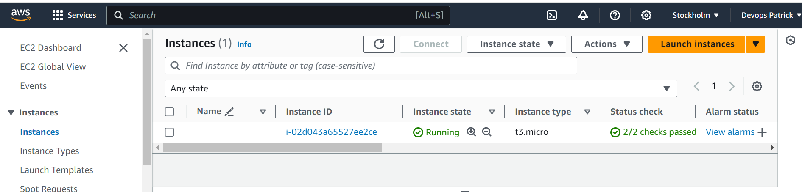

Then we open our terminal, enter into the directory we have our **.PEM** file saved and **ssh** into our virtual server

`ssh -i <private-key.pem> ubuntu@<EC2-Public-IP-address>`

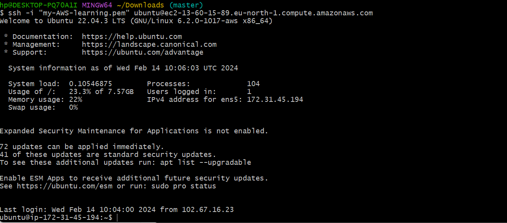

### Installing Nginx Web Server ###

Run the below command to install nginx in our remote server

`$ sudo apt update`
`$ sudo apt install nginx`

 Then we run the below command to confirm it has been properly installed. You should see a green notification saying **Actively running** to signify it is properly installed.

`$ sudo systemctl status nginx`

 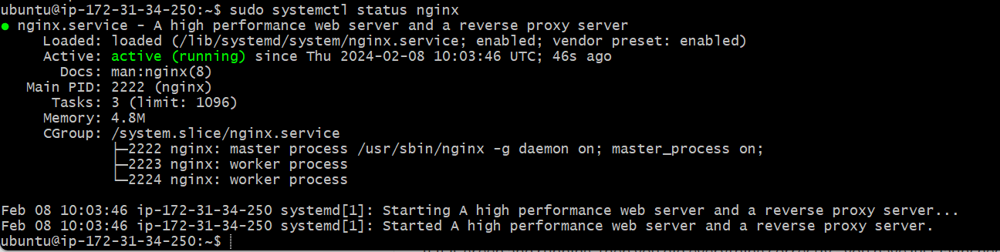

 Copy our EC2 instance public IP address and paste on a web browser to test our Nginx server.

 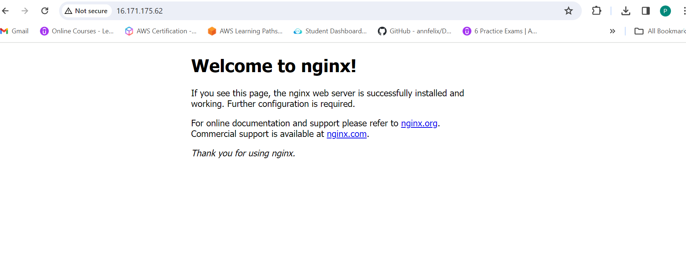

 ### Installing MySql Server ###

 In our terminal, we run the below command to install **mysql server**

`$ sudo apt install mysql-server`

when prompted, confirm installation by typing `Y` and the `Enter`

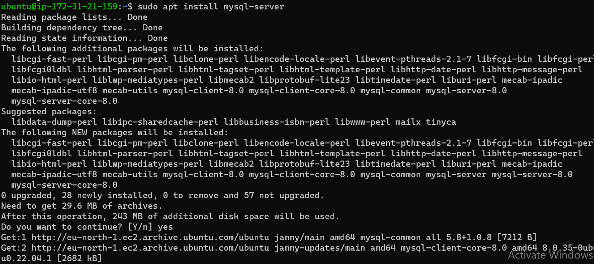

After installation, log into the server using the command

`$ sudo mysql`

This will connect to the MYSQL server as the administrative database user **root** which is inferred by the use of sudo. The below output will be seen.

To set password as `"PassWord.1"` for the **root** user, we run the below command

`ALTER USER 'root'@'localhost' IDENTIFIED WITH mysql_native_password BY 'PassWord.1'`

Then we "exit" mysql and run the below command to start the interactive script

`$ sudo mysql_secure_installation`

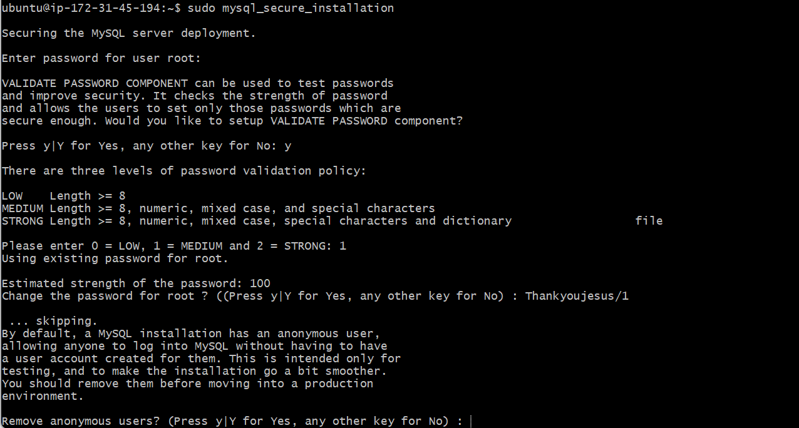

Log into mysql server with new password using the below command.

`$ sudo mysql -p`

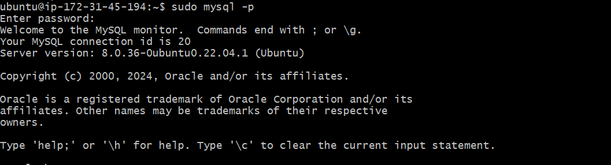

 ### Installing PHP ###

Run the below command to install PHP. This will help process code and generate dynamic content for the web server.

 `$ sudo apt install php-fpm php-mysql`

### Configuring Nginx to use PHP Processor ###

Create a root web directory for our domain with the below command

 `$ sudo mkdir /var/www/projectLEMP`

 Next we use the below command to assign ownership of the directory using the $USER environment variable to reference our system

 `$ sudo chown -R $USER:$USER /var/www/projectLEMP`

Open a new configuration file in Nginx **sites-available** using our preferred-line editor. We use the below command

`$ sudo nano /etc/nginx/sites-available/projectLEMP`

`#/etc/nginx/sites-available/projectLEMP`

`server {
    listen 80;
    server_name projectLEMP www.projectLEMP;
    root /var/www/projectLEMP;

    index index.html index.htm index.php;

    location / {
        try_files $uri $uri/ =404;
    }

    location ~ \.php$ {
        include snippets/fastcgi-php.conf;
        fastcgi_pass unix:/var/run/php/php8.1-fpm.sock;
     }

    location ~ /\.ht {
        deny all;
    }

}`

Below are what each of these directives do: 
- `listen`: Defines what port Nginx will listen on. In this case, it will listen on port `80` default for HTTP
- `root`: Defines the document root where files served by this website will be saved
- `index`: Defines in which order Nginx will prioritize index files for this website.
- `server_name`: Defines which domain names and/or IP addresse this server block should respond for.
- `location /`: The first location block includes a `try_files` dr=irective which checks for the existence of files or directories matching a URI request. If Nginx cannot find the a appropriate resource, it will return a 404 error.
- `location ~ \.php$`: This location block handles the actual PHP processing by pointing Nginx to the fastcgi-php.conf configuration file and the `php7.4-fpm.sock file`, which declares what socket is associated with `php-fpm`.
- `location ~/\.ht`: The last location block deals with `.htaccess` files which Nginx does not process. By adding the deny all directive, if any `.htaccess` files happen to find their way into the document root, they will not beserved to visitors.

  When you are done editing, save and close the file. You can do so by typing `Ctrl + X` and then `Y` and `ENTER`

We activate our configuration by linking to the config file from Nginx's `sites-enabled` directory using the below:

`$ sudo ln -s /etc/nginx/sites-available/projectLEMP /etc/nginx/sites-enabled/`

We test for syntax errors using the below command

`$ sudo nginx -t`

We disable Nginx default host that is currently configured to listen on port 80. For this, run: 

` $ sudo unlink /etc/nginx/sites-enabled/default`

When ready, reload Nginx to apply changes with below command

` $ sudo systemctl reload nginx`

Our new website is now active but the web root /var/www/projectLEMP directory is empty. We create an `index.html` file to test this with below command

`sudo echo 'Hello LEMP from hostname' $(curl -s http://169.254.169.254/latest/meta-data/public-hostname) 'with public IP' $(curl -s http://169.254.169.254/latest/meta-data/public-ipv4) > /var/www/projectLEMP/index.html`

Now refresh our browser with our same public IP address

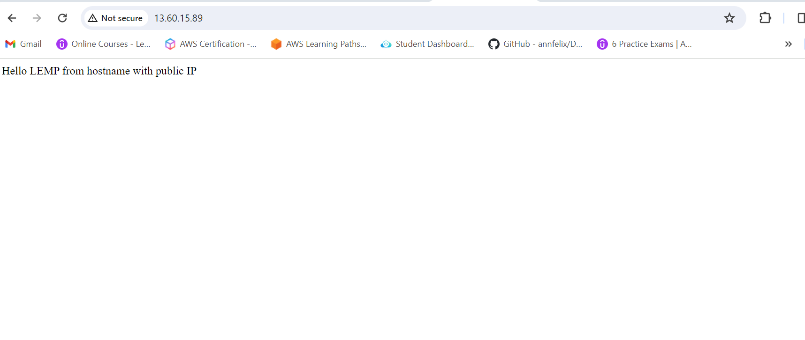

### Testing PHP with Nginx ###

To test Nginx can handle `.php` files of to our PHP processor, we run the following:

- First we create a test PHP file using the command `$ nano /var/www/projectLEMP/info.php `
- Then we paste the below in the file

`<?php
phpinfo();`

We the refresh our browser adding the `/info.php` to our *URL*. Below result is what we should see

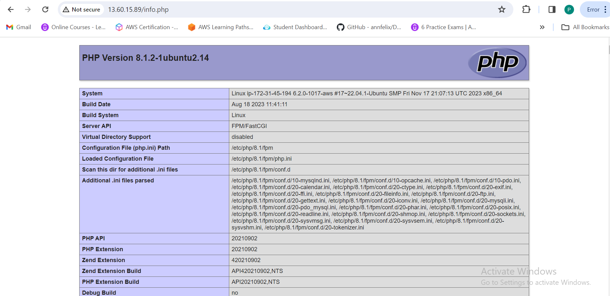

### Retrieving Data from MySQL database with PHP ###

First, we connect to our sql server using the below command and then enter our password

` $ sudo mysql -p`

To create database, run the below command in the mysql console

`mysql> CREATE DATABASE `example_database`;`

We create a new user and grant full priviledge rights. We use the below commands to set that up:

The following creates the user using mysql_native_password as authentication method

`mysql>  CREATE USER 'example_user'@'%' IDENTIFIED WITH mysql_native_password BY 'PassWord.1';`

To give him permission, run the below 

`mysql> GRANT ALL ON example_database.* TO 'example_user'@'%';`

Once permissions has been set, we exit the database and run the below command to log in as the newly defined user

`$ mysql -u example_user -p`

In the MySQL console, run the below command to view database. You will get the below output

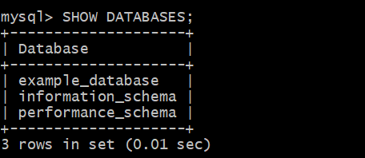

Next, we create a table names todo_list in our MySQL console using the below

`CREATE TABLE example_database.todo_list (item_id INT AUTO_INCREMENT,content VARCHAR(255),PRIMARY KEY(item_id));`

Insert a few rows of tables using the below command

`mysql> INSERT INTO example_database.todo_list (content) VALUES ("My first important item");`

To confirm data was successfully saved, run the below command, you should see an output

`mysql>  SELECT * FROM example_database.todo_list;`

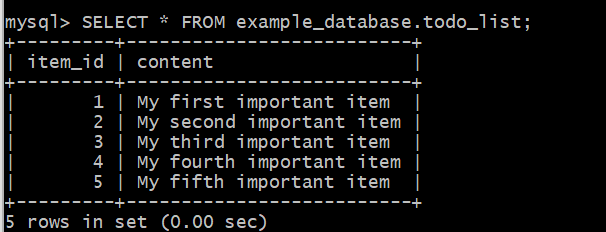

Also see below as reference for creating rows in our table.

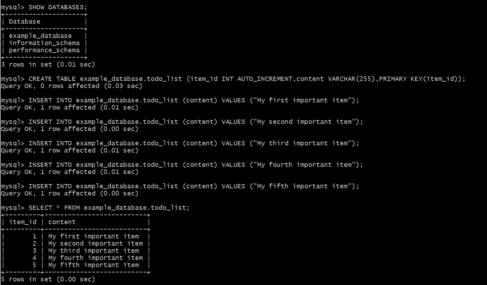

Now we create a PHP script that will connect to our MySQL server and query for our content. First we create a file in our web root directory using the below command

`$ nano /var/www/projectLEMP/todo_list.php`

Then we copy the below content into our script.

<?php
$user = "example_user";
$password = "PassWord.1";
$database = "example_database";
$table = "todo_list";

try {
  $db = new PDO("mysql:host=localhost;dbname=$database", $user, $password);
  echo "<h2>TODO</h2><ol>";
  foreach($db->query("SELECT content FROM $table") as $row) {
    echo "<li>" . $row['content'] . "</li>";
  }
  echo "</ol>";
} catch (PDOException $e) {
    print "Error!: " . $e->getMessage() . " ";
    die();
}

Save and exit.

We then refresh our *URL* adding `/todo_list.php` to our url and we should get the below.

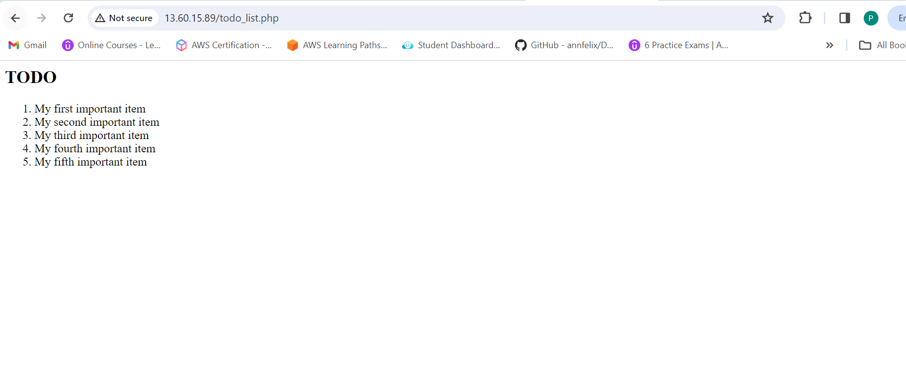

