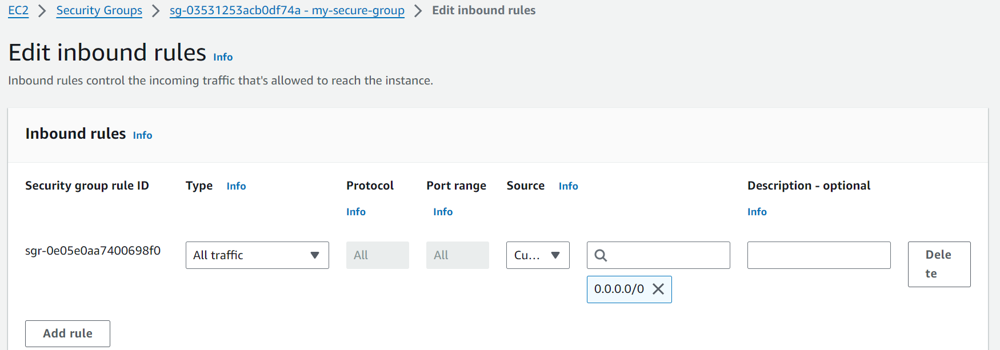
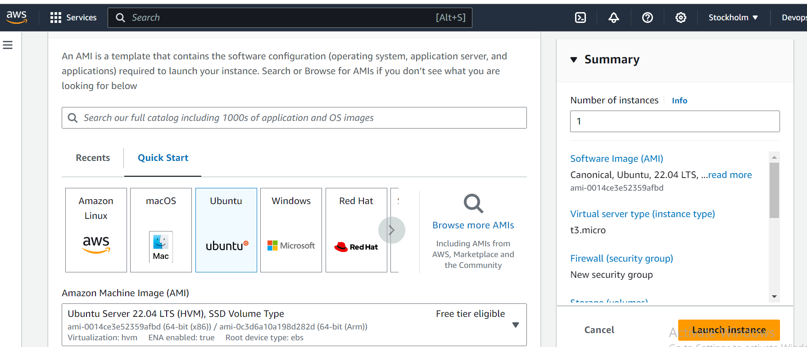
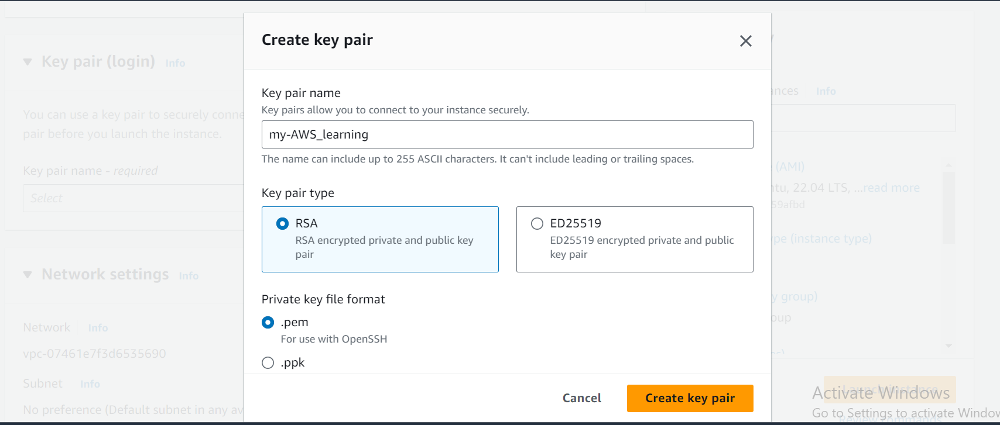
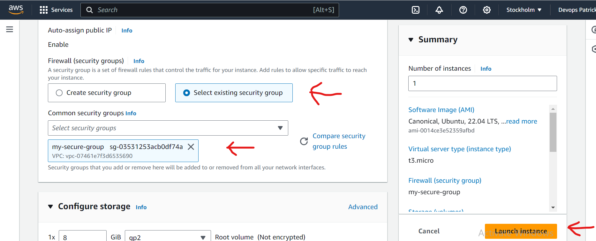
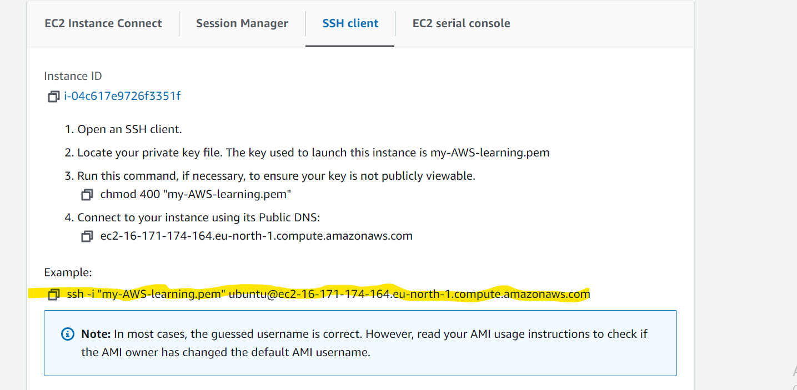
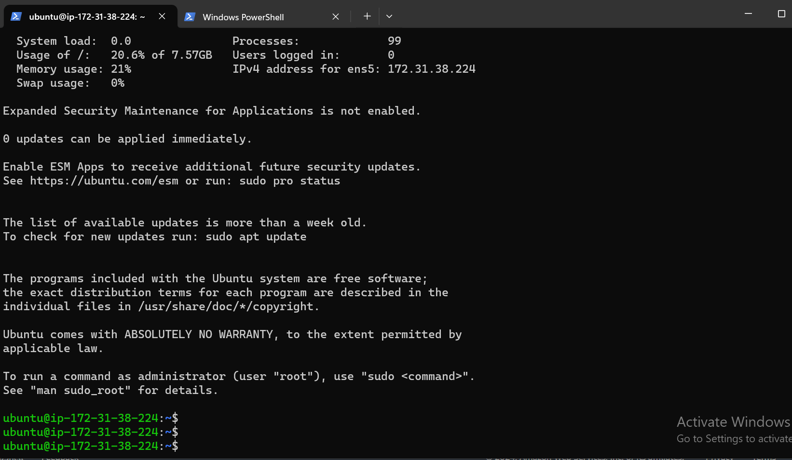

### Creating Virtual Linux Server on AWS ###
This documentation shows the steps taken to create a Linux virtual server on AWS 
# Creating an EC2 instance #
- Create a security group: This is a firewall, setting the rules on the inbound/outband traffic for our instance. In this case we have allowed **all traffic** for both inbound and outband traffic
**Note:** this is for test case purposes and in building your own EC2 instance, it is expected you will set more stringent rules for better security.

* Click on launch instance from the EC2 Dashboard, Select your virtual server to be created in this case we are creating ubuntu.

* Create a key pair: This helps us connect remotely to our instance.

Key pair is to saved in a **.pem** format.
**Note:** It is important to note where the directory the key is saved as we will need to be in that directory to ssh into our remote server

* Enable firewall: We must then enable our firewall. Security group has already been defined earlier so we just select it and then we can launch instance

EC2 instance running

When we connect to the instance, select SSH client, copy the highlighted key and paste on your local terminal. This will enable us locally launch our virtual terminal via ssh.

Ensure you are in the current directory where our .pem file is saved. How to do this, **cd** ***the directory*** and paste our highlighted key

Type yes and just like that, we have created our virtual server on AWS using an EC2 instance and successfully logged into it from our local terminal.

