## LAMP STACK IMPLEMENTATION ##
### Setting up LAMP STACK using EC2 instance ###
To do this, we need the following 
- An account on AWS.
- We create our virtual machine (EC2 instance). We will be using **Ubuntu server 20.04 LTS** from Amazon Machine Image (free tier)

Steps to create a virtual machine (EC2 instance), Click here [!Contributing guide](Creating_Server_on_AWS.md)

This launches us into our instance as show in below screenshot

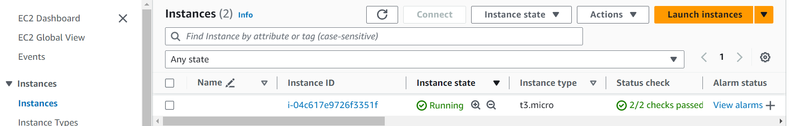

Then we open our terminal, enter into the directory we have our **.PEM** file saved and **ssh** into our virtual server

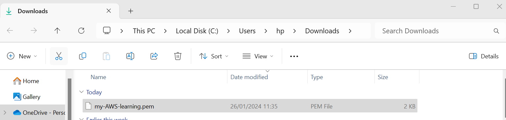

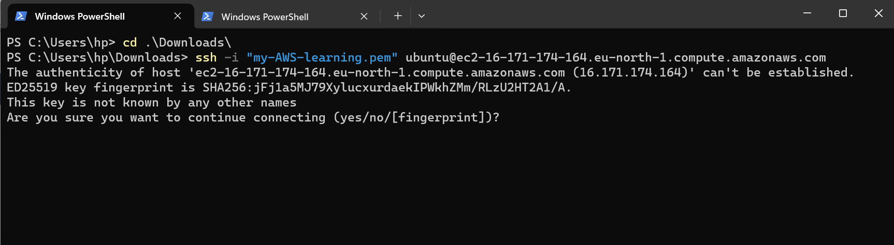

### Apachec2 Web Server Setup ###

In our virtual server, we run the below command to install **apache2** 

$ sudo apt install apache2

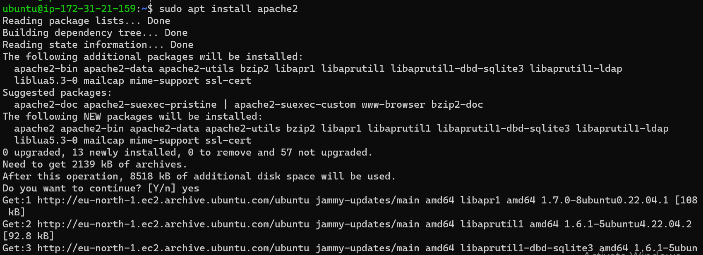

To verify **apache2** is now running as a service, use the below command. 

$  sudo  systemctl status apache2
>[!Note]
>You should have a green notification show active (running)

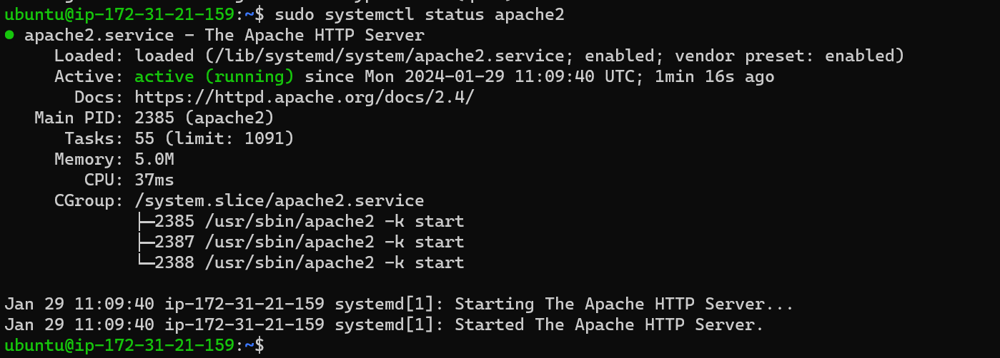

Once that is done, we copy the url (use the public IP from our instance) and paste on our browser to ensure our apache server is working. 
>[!Note]
>You should be able to launch the public ip on any web browser.

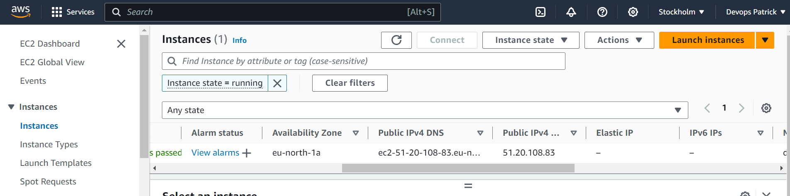

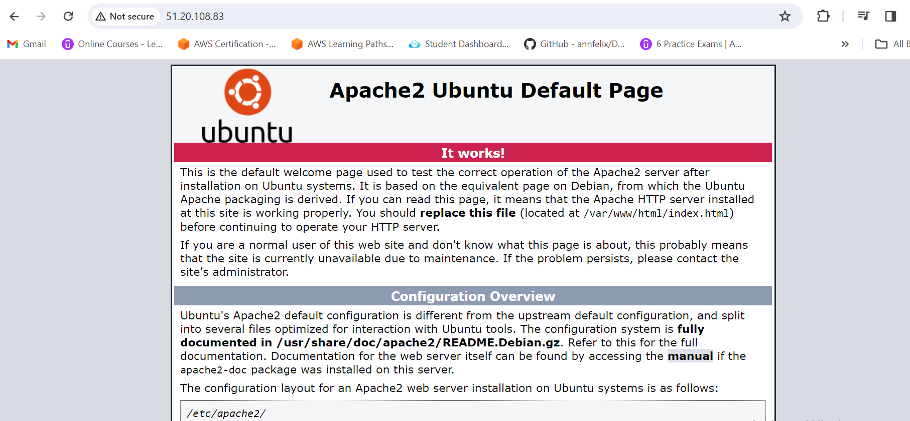

### My SQL Database Server setup ###

in our terminal, we run the below command to install **mysql server**

$ sudo apt install mysql-server

when prompted, confirm installation by typing Y and the Enter

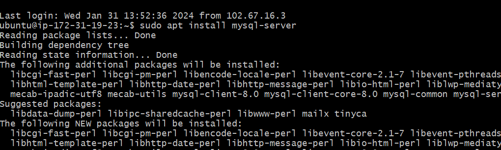

After installation, log into the server using the command

$ sudo mysql

This will connect to the MYSQL server as the administrative database user **root** which is inferred by the use of sudo. The below output will be seen.

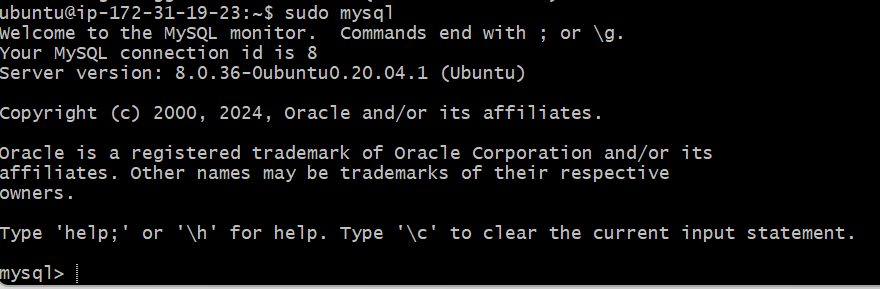

To set password as "PassWord.1" for the **root** user, we run the below command

ALTER USER 'root'@'localhost' IDENTIFIED WITH mysql_native_password BY 'PassWord.1'

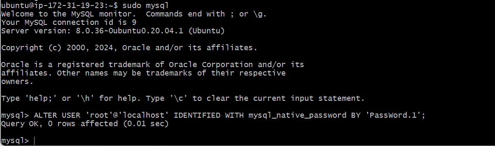

Then we "exit" mysql and run the below command to start the interactive script

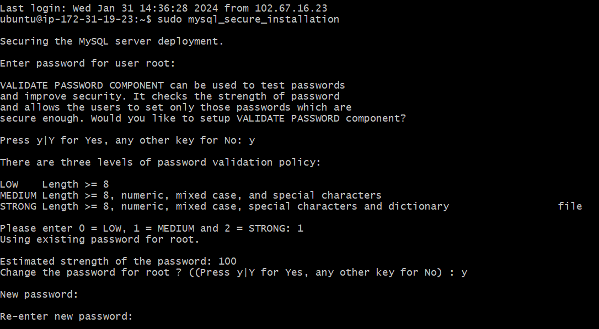

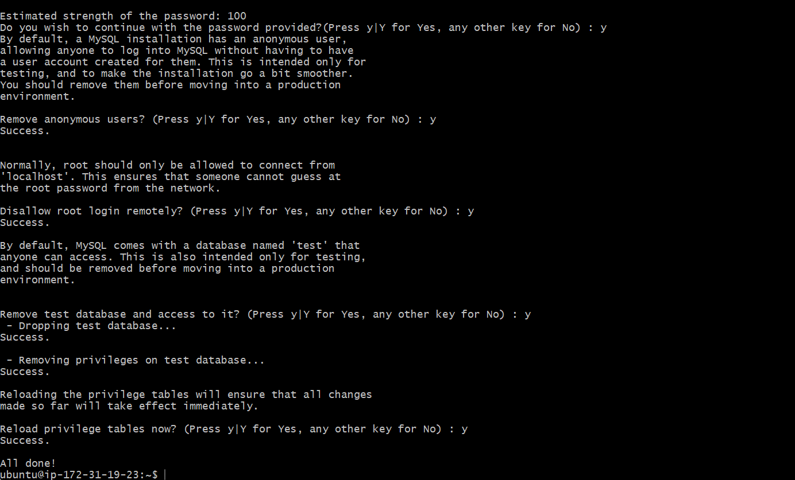

Log into mysql server with new password using the below command.

$ sudo mysql -p

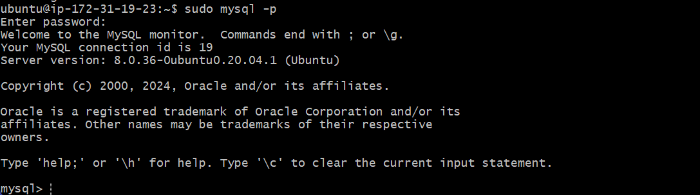

### Installing PHP ###

To setup PHP we run the below command

$ sudo apt install php libapache2-mod-php php-mysql

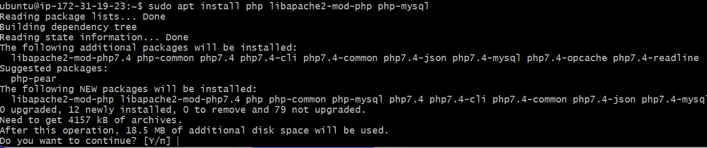

To check version, run the command

$ php -v

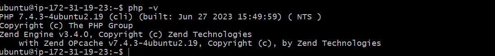

### Setting up a Virtual Host for Apache ###

To create a virtual for our website, we first create a directory "projectlamp" using the below command

$ sudo mkdir /var/www/projectlamp

Then we change ownership to our current environment using the below command

$ sudo chown -R $USER:$USER /var/www/projectlamp

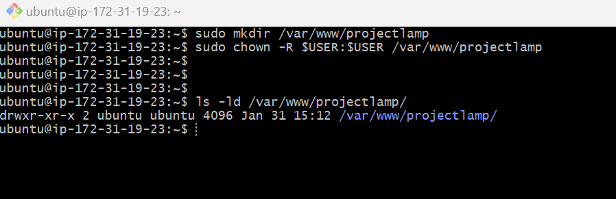

Then we create and open a new configiration file in Apache's **sites available** directory using the below command

$ sudo vi /etc/apache2/sites-available/projectlamp.conf

This will bring us into a blank file, paste the below after hitting the ***i*** to insert and paste the test

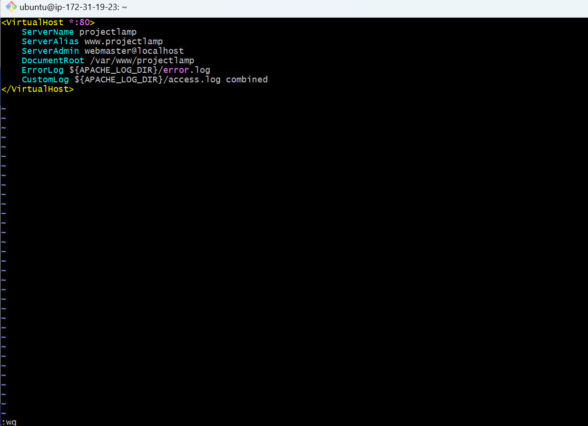

To save and close the file:
- Hit the ***esc***
- Type **:**
- Type ***wq*** to write and quit
- Hit ***enter** to save the file

To list the new file in the **sites-available** directory, we run the below command

$ sudo ls /etc/apache2/sites-available

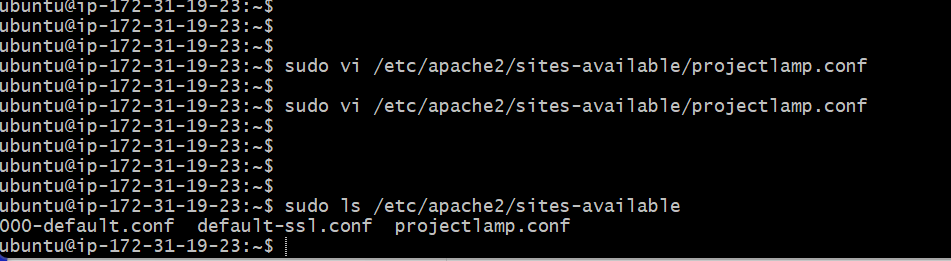
