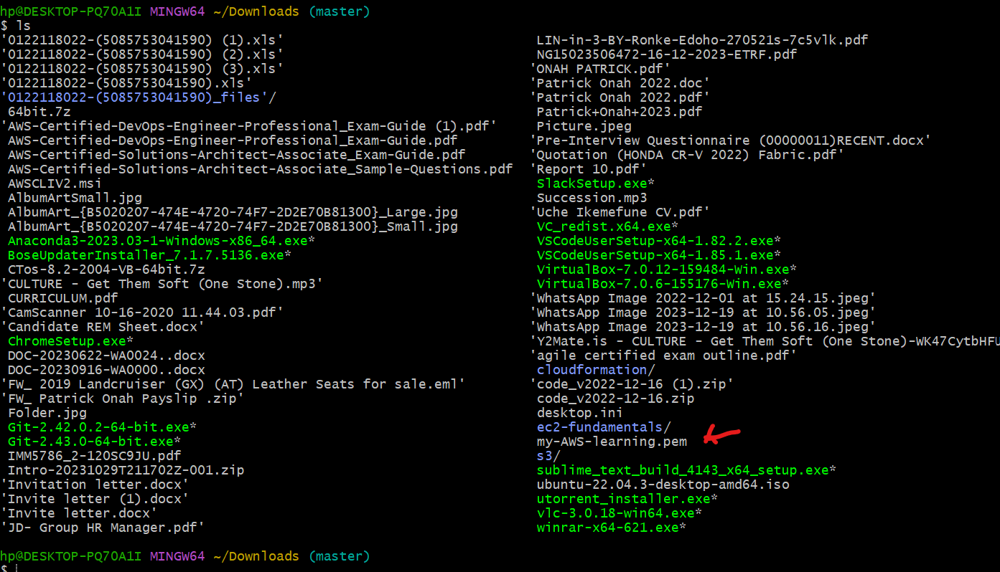

## LAMP STACK IMPLEMENTATION ##
### Setting up LAMP STACK using EC2 instance ###
To do this, we need the following 
- An account on AWS.
- We create our virtual machine (EC2 instance). We will be using **Ubuntu server 20.04 LTS** from Amazon Machine Image (free tier)

Steps to create a virtual machine (EC2 instance), Click here

This launches us into our instance as show in below screenshot

Then we open our terminal, in this case we are using **GIT BASH**, enter into the directory we have our **.PEM** file saved and **ssh** into our virtual server

### Apachec2 Web Server Setup ###

In our virtual server, we run the below command to install **apache2** 
![Reference to install apache2](Images
