# Linux commands
## Basic File Manipulation Commands
### Sudo
The **Sudo** command permits a user perform task that require administration/root user access

### Pwd (**Present Working Directory**)
The **pwd** command allows us know the directory we are currently in at any given time.

### Cd (**Change Directory**)
The **cd** command allows us switch to different directories
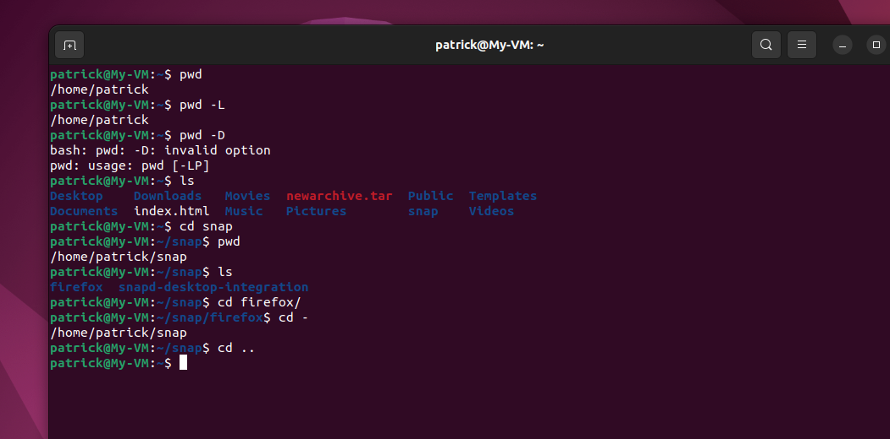
### ls (**List**)
The **ls** command allows us list the various files and directories within a system.
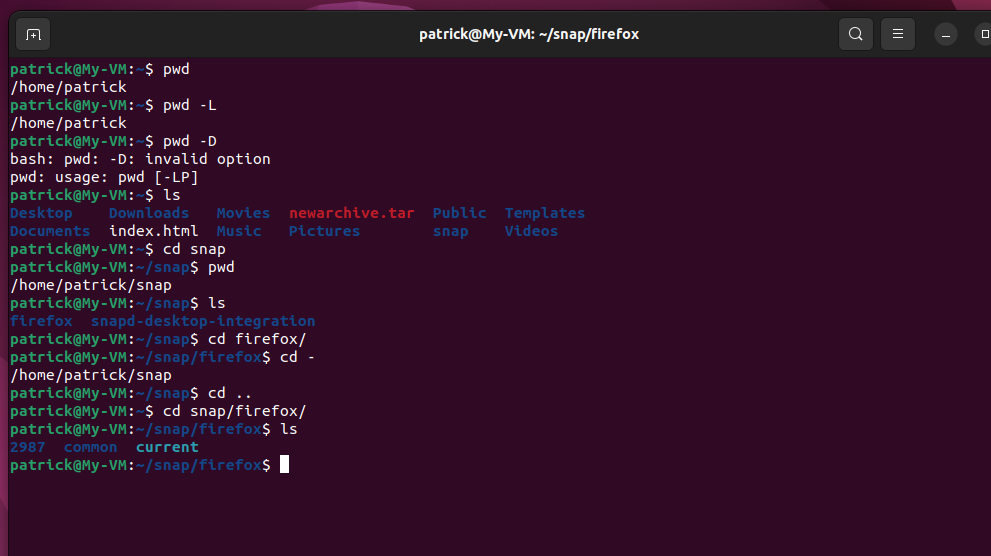
### Cat (**Concatenate**)
The **cat** command allow us list, combine and write files to a final standard output.
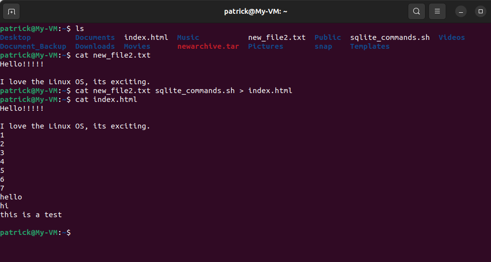
### Cp (**Copy**)
The **cp** command allows us copy files or directories and their content
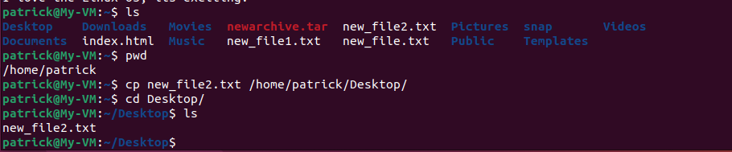
The below screenshot highlights **cp** command being used to copy a directory into another directory
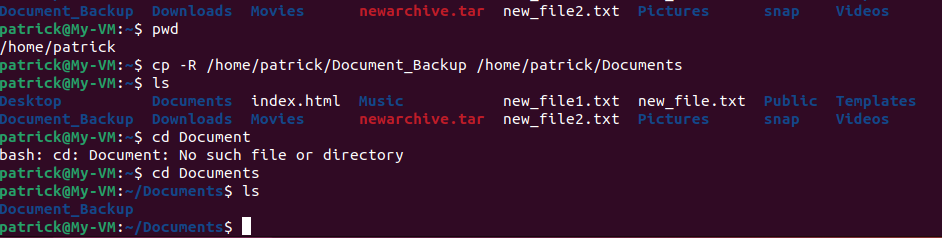
### Mv (**Move**)
The **mv** command allows us move or rename files or directories
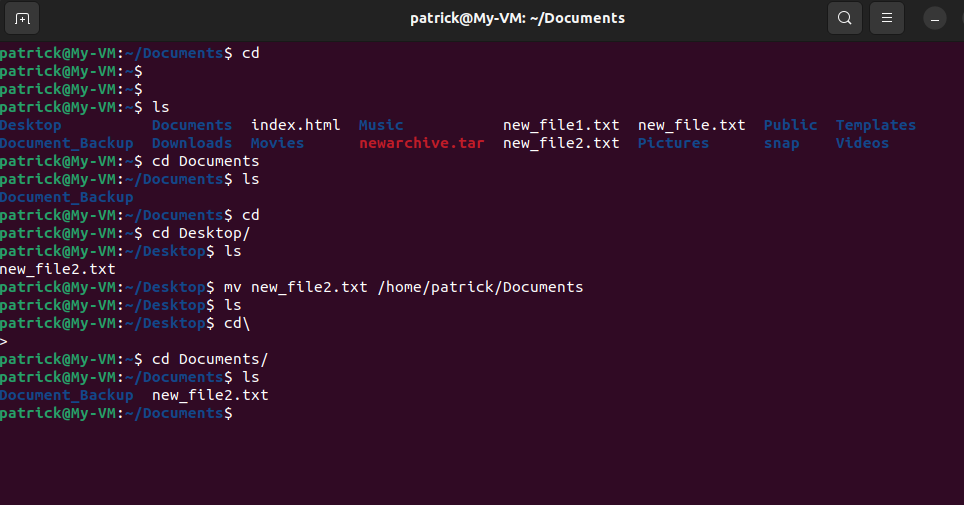
### Mkdir (**Make Directory**)
The **mkdir** command allows us create one or multiple directories at once and set permissions for them.

### rmdir (**Remove Directory**)
The **rmdir** command allows us remove one or multiple directories at once and set permissions for them
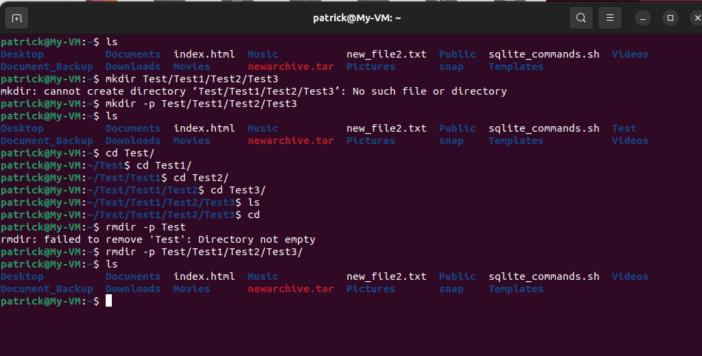
### rm (**Remove**)
The **rm** commands allows us delete files within a directory.
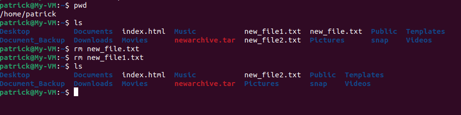
### Touch (**Touch**)
The **touch** command allows us create and empty file
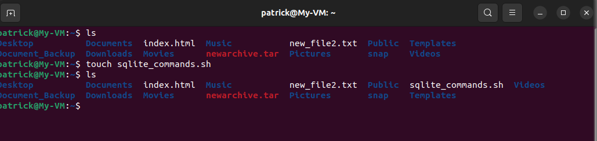
### Find (**Find**)
The **find** command allows us search for files within a specific directory

### DF
The **df** command allows us show the system disk space usage, usually shown in percentage(%) and Kilobyte (KB)
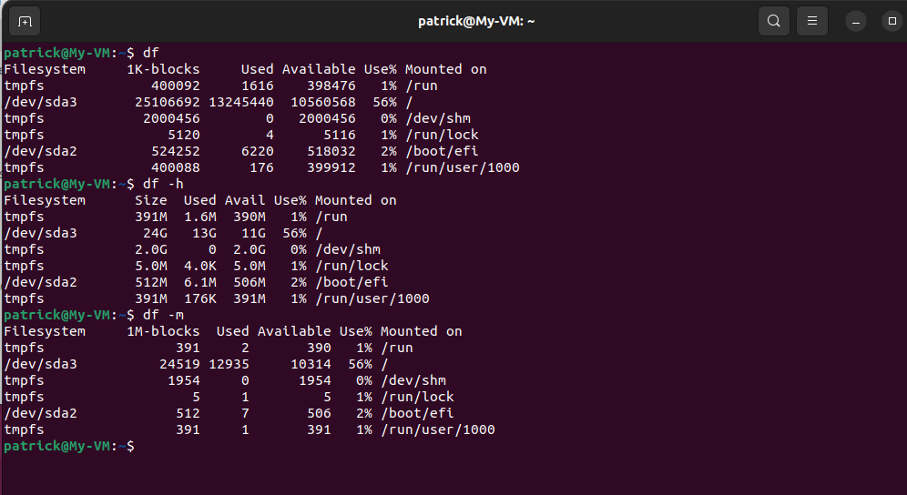
### DU
The **du** command allows us show how much space a file or directory takes up
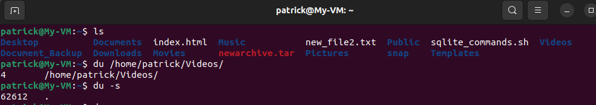
