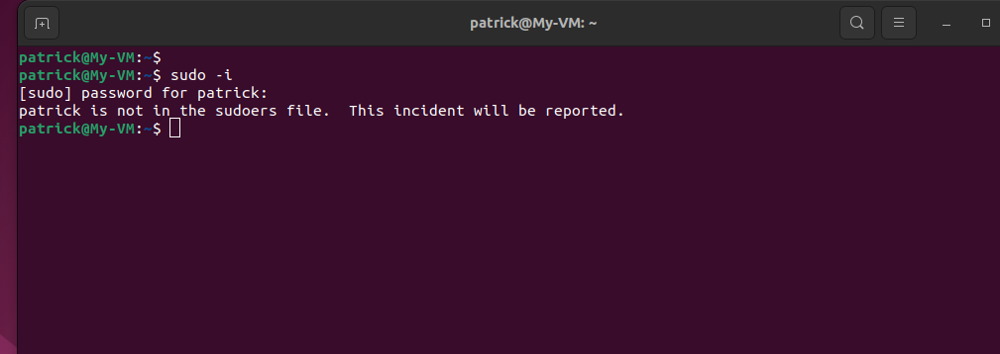
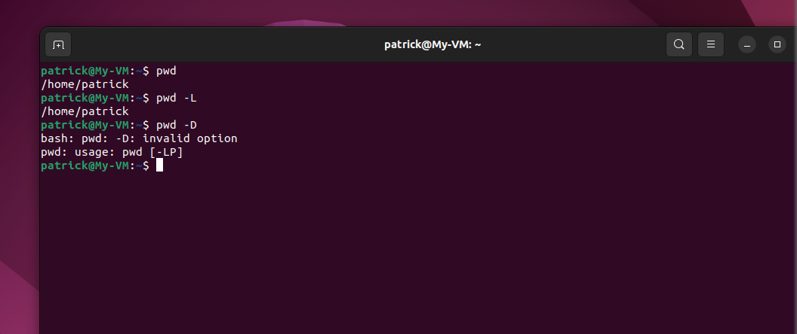

# Linux commands
## Basic File Manipulation Commands
### Sudo
The **Sudo** commands permits a user perform task that require administration/root user access

### Pwd **Present Working Directory**
The **pwd** commands allows us know the directory we are currently in at any given time.

